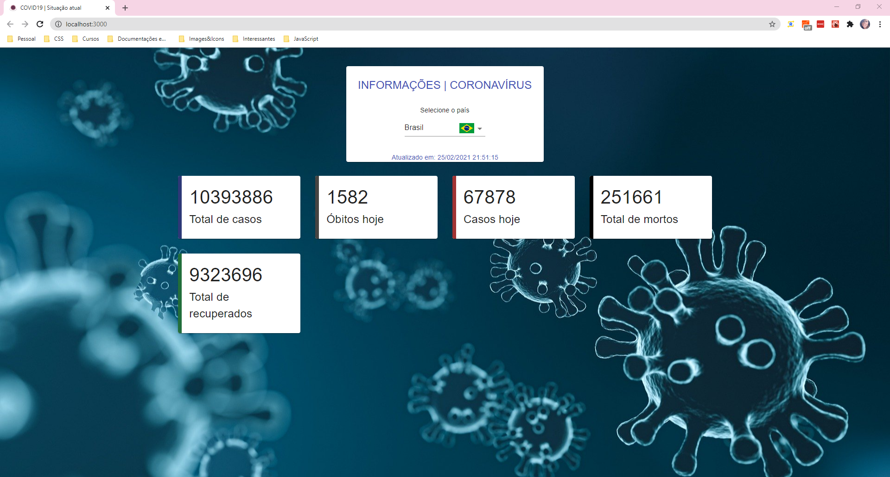

# Projeto: PWA com React para mapear os dados do COVID19

Feito através do bootcamp React Web Developer da DIO. Instruções do Bruno Carneiro.

### O que é uma PWA?
*Progressive Web Application* - além de ter a experiência do usuário como foco central, esta tecnologia é baseada em 3 pilares:
1. Confiabilidade - aquela em que você sempre pode contar, mesmo quando não há conexão com a internet.
2. Rapidez - carregamento de página em até 3 segundos.
3. Atração - quanto melhor a experiência, mais atraente serão as interfaces da sua aplicação.

:arrow_right: *[Saiba mais](https://vizir.com.br/2017/08/o-que-e-pwa-progressive-web-app-porque-isso-pode-aumentar-seus-resultados-mobile/)*

### Os requisitos são:
* [React](https://pt-br.reactjs.org/)
* [Javascript](https://developer.mozilla.org/pt-BR/docs/Web/JavaScript)

### Para executar o projeto:
*Antes de tudo, você precisa possuir o Node.js instalado na máquina, e um gerenciador de pacotes - poder ser o **NPM** ou **YARN**.*
1. Faça um clone:
> $ git clone link
2. Navegue até o repositório clonado:
> $ cd rwd-pwa-covid/
3. Baixe as dependências:
> $ npm install
4. Divirta-se:
> $ npm start

***

## Let's code! :mask:
